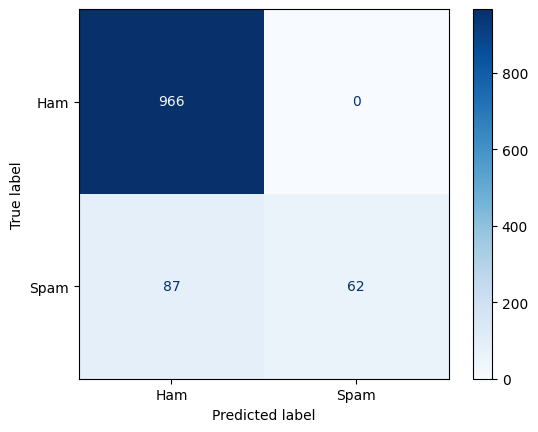

Project Overview

This project implements a text classification pipeline for spam detection using both classical machine learning and Transformer-based models. The goal is to compare a simple TF-IDF + Logistic Regression baseline with a fine-tuned DistilBERT model to evaluate performance on real-world SMS data.

Dataset

SMS Spam Collection Dataset

A public dataset of SMS messages labeled as ham (non-spam) or spam.

Includes ~5,500 messages with an imbalanced class distribution (more ham than spam).

Source: UCI Machine Learning Repository
.

Approach
1. TF-IDF + Logistic Regression Baseline

Preprocessing: tokenize and vectorize SMS messages using TF-IDF.

Model: Random forest classifier, tuned with random-search-cv, trained on the vectorized features.

Goal: provide a simple, interpretable baseline.

2. DistilBERT Fine-Tuning

Preprocessing: tokenize messages using DistilBERT tokenizer.

Model: DistilBERT (encoder-only Transformer) with a classification head for binary spam detection.

Fine-tuning: trained on the training portion of the dataset, evaluated on a held-out validation set.

Goal: leverage pre-trained language representations for superior performance.

RESULTS

| Model                        | Accuracy | Precision | Recall | F1-Score |
| ---------------------------- | -------- | --------- | ------ | -------- |
| DistilBERT (Transformer)     | 0.9937   | 0.9863    | 0.9664 | 0.9763   |
| TF-IDF + Logistic Regression | 0.9186   | 1.0000    | 0.4160 | 0.5889   |

### Confusion Matrices

**DistilBERT (Transformer)**  

**TF-IDF + Logistic Regression (Baseline)**  

